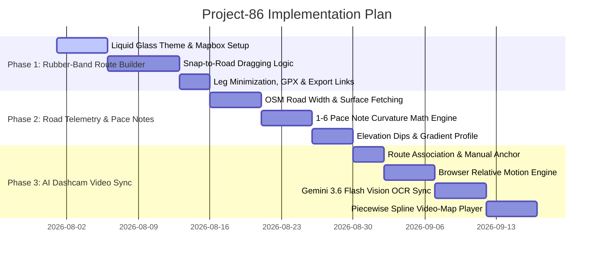

# Concept Plan: Interactive Driving Routes & Car Garage Web App (`project-86`)

## 1. Executive Summary & Vision
An interactive, ultra-high-aesthetic web application built for driving enthusiasts and road trippers. Taking visual inspiration from **Liquid Glass / Glassmorphism** and apps like **Flighty** (sleek typography, dark mode, rich stats, map-centric interface), this platform solves the biggest flaw in modern navigation: **standard apps like Google Maps aggressively push the fastest highway routes instead of scenic, fun backroads**.

This platform lets users effortlessly draw, drag, and snap custom scenic routes on a map, view detailed trip fuel costs for their car, preview the drive via **3D Satellite & optional Street View Flyby hyperlapse**, inspect **Rally Pace Notes (1-6 corner ratings, road width, surface quality, dips/crests)**, sync non-GPS dashcam videos via **AI & Computer Vision** when a route and anchor are supplied, and export custom routes to **Google Maps / Waze** with a GPX fallback for routes those links cannot represent.

---

## 2. Open-Source Projects Research: Speed & Visual Map Localization

### A. Projects for Estimating Car Speed or Relative Motion from Dashcam Video (No GPS)

| Project / Repository | Methodology | How It Works | GitHub Link / Reference |
| :--- | :--- | :--- | :--- |
| **Comma.ai SpeedChallenge** 🏆 | Optical Flow + Deep 3D ConvNet | George Hotz's open-source benchmark for predicting ego-vehicle speed directly from raw monocular dashcam video. | [commaai/speedchallenge](https://github.com/commaai/speedchallenge) |
| **adamvest / Vehicle-Speed-Prediction** | ConvLSTM (DeepVO) / 3D ResNet | Uses spatial-temporal optical flow across consecutive video frames to regress speed in mph/kph. | [adamvest/vehicle-speed-prediction](https://github.com/adamvest/vehicle-speed-prediction) |
| **Roboflow Supervision** | YOLOv8 + Perspective Homography Matrix | Calculates pixel-to-meter displacement vectors across video frames to measure vehicle speed. | [roboflow/supervision](https://github.com/roboflow/supervision) |

---

### B. Projects for Overlaying a Car on a Map Purely from Video (No GPS)

| Project / Repository | Methodology | How It Works | GitHub Link / Reference |
| :--- | :--- | :--- | :--- |
| **Cross-View Geo-Localization (DReSS)** 🏆 | Vision Transformer (ViT) + Siamese Net | Matches ground-level dashcam video frames directly to overhead satellite map tiles to locate the car on a map without GPS. | [SummerpanKing/DReSS](https://github.com/SummerpanKing/DReSS) |
| **Mapillary OpenSfM (Meta)** | Structure from Motion (SfM) + Visual Odometry | Reconstructs 3D camera trajectory from dashcam video and aligns the path onto OpenStreetMap (OSM) vector roads. | [mapillary/OpenSfM](https://github.com/mapillary/OpenSfM) |
| **CV-to-Maps** | YOLOv8 + OpenStreetMap (OSM) Querying | Detects landmarks & road signs in dashcam video and matches them to OpenStreetMap vector geometry coordinates. | [sasha-kap/CV-to-Maps](https://github.com/sasha-kap/CV-to-Maps) |
| **AnyLoc** | Universal Visual Place Recognition | Extracts deep visual descriptors from video frames and matches them against geo-tagged map image databases. | [concept-graphs/AnyLoc](https://github.com/concept-graphs/AnyLoc) |

---

## 3. Comprehensive AI & Computer Vision Comparison for Video Sync

### Video Analysis & Motion Calibration Technologies Comparison

| Model / Technique | **Primary Capability** | **Speed / Latency** | **Cost / Quota** | **Accuracy for Road Signs & Landmarks** | **Privacy / Setup** | **Verdict** |
| :--- | :--- | :--- | :--- | :--- | :--- | :--- |
| **Google Gemini 3.6 Flash** 🏆 | Multimodal Vision + Road Sign OCR + Context | ⚡ Ultra-fast (~0.3s) | 💲 **Ultra Cheap** ($0.075 / 1M tokens) | ⭐⭐⭐⭐⭐ (State-of-the-art UK sign & landmark OCR) | ☁️ Direct API Call | **Primary Choice (Latest & Best)** |
| **Google Cloud Video Intelligence API** | Full video OCR, Shot Detection, Text Tracking | 🐢 Batch Async (~1-3 mins per video) | ⚠️ **Expensive** ($0.10–$0.15 / min of video) | ⭐⭐⭐⭐ (Great raw text extraction, lacks LLM context) | ☁️ Requires Google Cloud Storage upload | High Enterprise Cost for long videos |
| **OpenAI GPT-4o-mini** | Multimodal Vision + Frame OCR | ⚡ Fast (~1.0s) | 💲 Cheap ($0.15 / 1M tokens) | ⭐⭐⭐⭐ (High accuracy) | ☁️ Direct API Call | Backup API Option |
| **Optical Flow (Farneback / LK)** | Real-time relative motion & turn detection | 🚀 Instant (<10ms / frame) | 🆓 **100% Free** (Pure Canvas Math) | ⭐⭐⭐ (Measures relative motion & cornering) | 🔒 **100% Local Browser** | **Hybrid Motion Layer (Runs locally)** |
| **YOLOv8 + PaddleOCR (ONNX)** | Local object detection for road signs | ⚡ Fast (~30ms / frame) | 🆓 **100% Free** (Runs in WebAssembly) | ⭐⭐⭐⭐ (Detects turn signs & speed signs) | 🔒 **100% Local Browser** | Free Offline Alternative |

**Telemetry calibration boundary:** Farneback/LK returns pixel displacement, not an absolute vehicle speed. The MVP reports relative motion and turn/cornering events only. Absolute mph/kph requires camera calibration plus a scale source (for example, GPS/OBD data or a user-confirmed known-distance segment); it must not be inferred from arbitrary monocular video alone.

**GPS-free localization boundary:** Optical flow and OCR do not produce latitude/longitude control points. For the MVP, a user must associate the upload with a saved/selected route and provide at least one manual video-to-route anchor (with optional additional anchors for better alignment). Visual geolocation/map matching such as DReSS, OpenSfM, or AnyLoc is a later, explicitly scoped enhancement for unanchored uploads.

---

## 4. Core Feature: Rally Telemetry & Road Dynamics Engine (RODS-Style Inspection)

### A. Data Sources Architecture
* **OpenStreetMap Overpass Vector Tags**: `width=*`, `surface=*`, `smoothness=*`, `barrier=*`.
* **Mapbox Terrain-RGB DEM**: 0.1m precision elevation, gradient %, dips & crests.
* **Curvature Geometry Engine**: Automatic 1-to-6 rally pace note classification.

### B. Automatic 1-to-6 Rally Pace Note Classification

| Pace Note | Corner Type | Curve Radius ($R$) | Driving Description |
| :---: | :--- | :---: | :--- |
| **1** 🛑 | **Hairpin** | $R < 15\text{m}$ | Ultra-tight 1st gear hairpin / handbrake turn |
| **2** ⚠️ | **Heavy** | $15\text{m} \le R < 35\text{m}$ | Sharp 2nd gear corner |
| **3** 🟡 | **Medium** | $35\text{m} \le R < 65\text{m}$ | Technical 3rd gear backroad corner |
| **4** 🟢 | **Open** | $65\text{m} \le R < 100\text{m}$ | Sweeping 4th gear bend |
| **5** 🔵 | **Fast** | $100\text{m} \le R < 160\text{m}$ | High-speed 5th gear curve |
| **6** ⚡ | **Slight / Flat** | $R \ge 160\text{m}$ | Full-throttle gentle curve |

---

## 5. Comprehensive Map API Comparison & Hybrid Strategy

### Detailed Map API Comparison Matrix

| Feature / Metric | **Mapbox GL JS** 🏆 | **Google Maps JS API** | **MapLibre GL JS + MapTiler** |
| :--- | :--- | :--- | :--- |
| **Free Quota** | **50,000 map loads/mo** free | ~$200 monthly credit (~28k loads) | **100,000 tile requests/mo** free |
| **Credit Card Needed?**| ❌ **No** (Instant signup) | ⚠️ **YES** (Mandatory Google Cloud setup) | ❌ **No** |
| **Satellite / Hybrid Mode**| ✅ **YES** (`mapbox/satellite-streets-v12` + 3D Terrain) | ✅ **YES** (`mapTypeId: 'hybrid'`) | ✅ **YES** (`maptiler/satellite`) |
| **Route Flyby / Preview**| ✅ **3D Terrain Camera Flythrough** (Smooth 60fps) | ✅ **Google Street View Hyperlapse** (Ground panoramas; separate paid integration) | ⚠️ Basic camera animation |
| **Non-GPS Dashcam Sync**| ✅ **Gemini 3.6 Flash + Local Optical Flow Hybrid, route association required** | ✅ Custom WebGL canvas overlay | ✅ Custom Canvas |
| **Aesthetics / Flighty Vibe**| ⭐⭐⭐⭐⭐ (Vector GL, glowing lines, 3D terrain) | ⭐⭐⭐ (Generic style, custom dark is dated) | ⭐⭐⭐⭐⭐ (Custom vector dark themes) |
| **Live Traffic Insights**| ✅ **Included** (`mapbox-traffic-v1` live layer + `driving-traffic` routing) | ✅ **Best in class** (Native traffic layer) | ❌ **No native traffic** in free MapTiler tier |

---

## 6. UI Design System: "Liquid Glass" Aesthetic

High priority on a **WOW-factor** user interface that feels premium, modern, and fluid:

* **Glassmorphism Panels**: Translucent frosted panels with `backdrop-filter: blur(24px)`, subtle 1px inner borders (`border: 1px solid rgba(255, 255, 255, 0.1)`), and soft drop shadows.
* **Color Palette**: Deep Obsidian Dark Mode (`#0a0b10`), Neon Cyan/Amber route highlights (`#00f0ff`, `#ff9900`), and crisp high-contrast typography (Inter / Outfit / SF Pro).
* **Micro-Animations**: Animated glowing polylines along active routes, smooth hover card scaling, and tactile button states.

---

## 7. Technical Stack & Free Tier Strategy

| Component | Technology | Rationale |
| :--- | :--- | :--- |
| **Frontend** | Next.js (App Router, React) / Vite + TS | High performance, fast routing |
| **Styling** | Vanilla CSS + CSS Modules | Full control over Liquid Glass blur & glow animations |
| **Map Engine** | **Mapbox GL JS** | **50,000 free map loads/mo**, Map Matching API, satellite + 3D terrain, live traffic v1 layer |
| **AI Video Engine** | **Google Gemini 3.6 Flash + Optical Flow** | Hybrid local motion tracking & cloud landmark OCR; reports relative motion unless calibrated |
| **Video Storage** | **Cloudflare R2** | **10 GB free storage**, 0 egress fees (avoids Vercel bandwidth limits) |
| **Road Physics Engine**| OpenStreetMap Overpass API + Turf.js | Computes 1-6 pace notes, road width, surface type, and dips |
| **Flyby Engine** | Mapbox FreeCamera API + optional Google Street View JS API | Mapbox 3D drone mode is the free-tier default. Street View hyperlapse requires a separately provisioned Google Maps Platform project, API key, enabled billing, and applicable quota; it is disabled when those credentials are absent. |
| **Database & Auth**| **Supabase** (Free Tier) | Store user car garage, saved routes, and reviews |
| **Mobile Nav Export**| Google Maps Directions URL, Waze Deep Link, and GPX export | Generates bounded waypoint links where supported; preserves arbitrary custom geometry through GPX, with optional per-leg links |

### Integration and export boundaries

* **Street View is optional, not part of the Mapbox free-tier promise.** It requires its own Google Maps Platform credentials and billing-enabled project. The application must expose the Mapbox 3D flyby when those credentials are unavailable and must not silently require a Google key.
* **Navigation links cannot preserve every custom route.** Google Maps Directions URLs accept only a bounded number of waypoints, and Waze deep links navigate to a destination rather than importing an arbitrary polyline or multi-leg route. Export the complete route as GPX/KML-compatible geometry (GPX for the MVP), and offer per-leg Google Maps links when a route exceeds the supported waypoint limit. Clearly label links as navigation shortcuts rather than lossless route exports.

---

## 8. Phased Roadmap

The Phase 3 player may fit video to the map only after route association and anchor control points exist. Metric speed is a separate calibrated-data path, not an output of uncalibrated optical flow.
